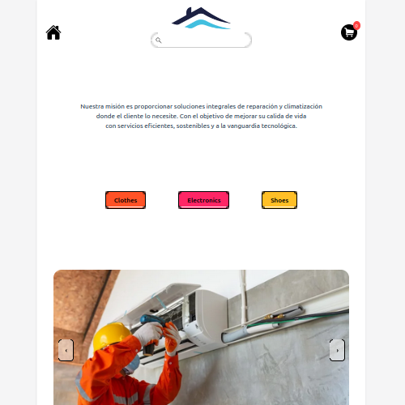

# Portafolio Profesional de David Salazar

Este es el repositorio de mi portafolio profesional como desarrollador web especializado en front-end. Aquí podrás encontrar información sobre mis habilidades, proyectos destacados y formas de contacto.

## 🚀 Tecnologías Utilizadas

- **Framework**: [Astro](https://astro.build/)
- **Estilos**: [Tailwind CSS](https://tailwindcss.com/)
- **Integraciones**: Astro SEO, Astro Navbar

## 📂 Estructura del Proyecto

```text
/
├── public/
│   ├── icons/       # Iconos utilizados en el portafolio
│   ├── images/      # Imágenes de proyectos y recursos
├── src/
│   ├── components/  # Componentes reutilizables
│   ├── layouts/     # Layout principal
│   ├── pages/       # Páginas principales
│   ├── sections/    # Secciones del portafolio
│   ├── styles/      # Estilos globales
│   ├── utils/       # Utilidades (si aplica)
├── astro.config.mjs # Configuración de Astro
├── tailwind.config.mjs # Configuración de Tailwind CSS
└── package.json     # Dependencias y scripts
```

## 🛠️ Instalación y Uso

1. Clona este repositorio:
   ```bash
   git clone https://github.com/SalazarWeb/portfolio.git
   ```

2. Instala las dependencias:
   ```bash
   npm install
   ```

3. Inicia el servidor de desarrollo:
   ```bash
   npm run dev
   ```

4. Abre tu navegador en `http://localhost:4321`.

## 🌟 Capturas de Pantalla

### Página Principal


### Sección de Proyectos


## 📧 Contacto

Si tienes alguna pregunta o deseas colaborar, no dudes en contactarme:
- **Email**: [davidsalazar.web@gmail.com](mailto:davidsalazar.web@gmail.com)
- **LinkedIn**: [linkedin.com/in/salazarweb](https://linkedin.com/in/salazarweb)
- **GitHub**: [github.com/SalazarWeb](https://github.com/SalazarWeb)

---

¡Gracias por visitar mi portafolio!
